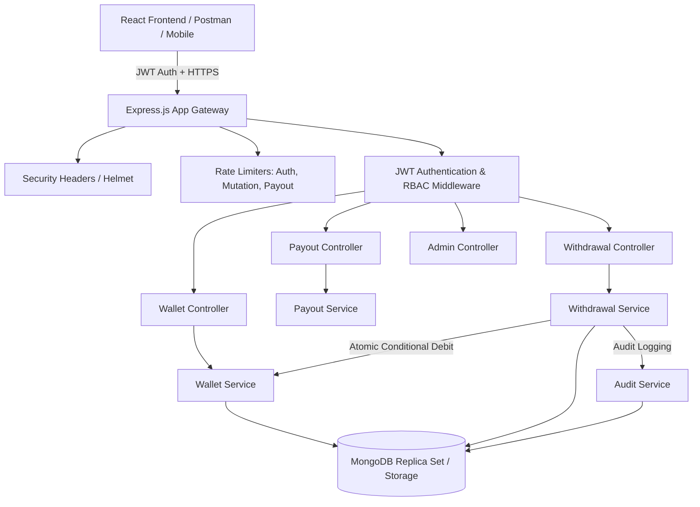
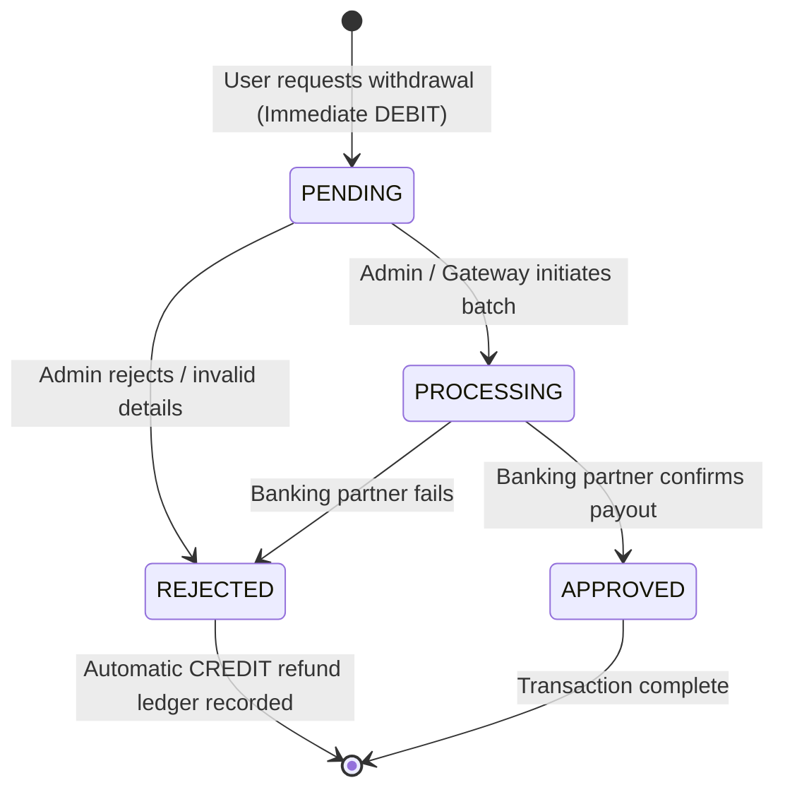

# Architecture Specification — VELoop Rewards

## 1. System Philosophy & Source of Truth

The VELoop Rewards system treats the **backend as the absolute source of truth**. 
No client application (web, mobile, or third-party) is ever permitted to dictate financial balances, required conversion rates, denomination availability, or transaction state transitions.

### Core Architectural Axioms
1. **Ledger Immutability:** Current balances are projections of historical ledger transactions. Every balance alteration requires a corresponding `WalletTransaction` debit or credit entry.
2. **Deterministic Double-Entry Logic:**
   $$\text{Current Balance} = \text{Initial Balance} + \sum \text{Credits} - \sum \text{Debits} \pm \text{Adjustments}$$
3. **Atomic State Transitions:** No deduction can occur without a corresponding withdrawal record, and no withdrawal record can exist without balance deduction.
4. **Authoritative Backend Pricing:** Denominations, exchange rules, and required currency amounts are fetched from database models (`PayoutOption`), never trusted from client payloads.
5. **Idempotency Guarantee:** Network retries, duplicate clicks, or reconnection events bearing the same `Idempotency-Key` return identical cached results without duplicate balance deductions.

---

## 2. High-Level System Architecture



---

## 3. Financial Lifecycle: Option A (Immediate Deduction Strategy)

The system adopts **Option A (Immediate Deduction)** for reward redemptions.

### Lifecycle Phases


### Why Option A?
- **Prevents Overdrafting / Double-Spending:** Once a user requests ₹100 UPI (19,500 VEs), those VEs are immediately removed from available balance, preventing race conditions against subsequent concurrent redemptions.
- **Auditable Reversal Trail:** If an administrator or payment gateway rejects the withdrawal:
  - The original `DEBIT` ledger entry remains intact for historical audit.
  - A new `CREDIT` ledger record is created with source `WITHDRAWAL_REFUND` referencing the `withdrawalId`.
  - The user's balance is safely incremented back to its original state.

---

## 4. Race Condition & Concurrency Defense

### The Challenge
If a user with **10,000 VEs** submits two concurrent withdrawal requests of **8,000 VEs** each at the exact same millisecond, simple memory or read-then-write checks can result in -6,000 VEs (double spend).

### Two-Layer Defense Strategy
1. **Document-Level Atomic Conditional Decrement:**
   ```javascript
   Wallet.findOneAndUpdate(
     { userId: userId, ves: { $gte: requiredAmount } },
     { $inc: { ves: -requiredAmount } },
     { new: true, session }
   );
   ```
   MongoDB's WiredTiger storage engine locks the specific document during write execution. Only requests where `ves >= requiredAmount` succeed; concurrent requests finding less balance fail immediately and return `null`.
2. **MongoDB Session Transactions (Multi-Document Atomicity):**
   Where supported (replica sets), the operation is wrapped in a session transaction (`startTransaction()`). The atomic debit, `Withdrawal` insertion, `WalletTransaction` creation, and `AuditLog` record are committed as a single unit or rolled back on error.
3. **Compound Unique Idempotency Index:**
   `Withdrawal` schema enforces `{ userId: 1, idempotencyKey: 1 }` with a unique index. A duplicated request sent in parallel fails at the database level if it attempts duplicate insertion.
